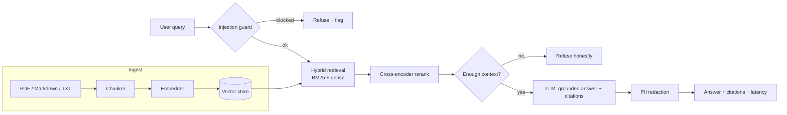

# 🔎 InsightRAG

**Production-grade, agentic RAG over your own documents** — hybrid retrieval (BM25 + dense), cross-encoder reranking, grounded answers *with citations*, RAGAS-style evaluation, and safety guardrails. **Runs fully offline and free by default** (no API key, no GPU), and swaps to real local or hosted models with a single environment variable.

[](https://github.com/ranafaraz/InsightRAG/actions/workflows/ci.yml)
[](https://www.python.org/)
[](LICENSE)
[](https://github.com/astral-sh/ruff)

---

## Demo

> **Try it locally in one line:** `streamlit run ui/streamlit_app.py` — load the bundled sample docs and ask away, no setup, no keys.
>
> 🔗 _Hosted demo (Hugging Face Space / Streamlit Community Cloud) link + a 20–30s screen-capture GIF will be added here._ See [`docs/`](docs/) for the deployment notes.

---

## The technical win

On the bundled 12-question EdTech/finance benchmark, with the default **fully offline** backends:

- **Recall@5 = 0.92**, **MRR = 0.93** — hybrid retrieval matches or beats BM25-only and dense-only on every metric.
- **Cross-encoder reranking cuts prompt context by ~58%** (≈933 → ≈389 tokens/query) while keeping the right passage on top — directly lowering LLM cost and latency.
- **Faithfulness = 0.91** with an honest **refusal path** when retrieval is weak (the assistant says "I don't know" instead of hallucinating).
- **Prompt-injection detection F1 = 1.0** and **PII redaction accuracy = 1.0** on the bundled labelled sets.

Every number above is reproducible with one command and **no API key** — see [Evaluation](#evaluation).

---

## Architecture



Full design rationale and trade-offs: [`docs/architecture.md`](docs/architecture.md).

---

## Quickstart

### Run it offline in 30 seconds (no keys, no downloads)

```bash
git clone https://github.com/ranafaraz/InsightRAG.git
cd InsightRAG
pip install -e ".[dev]"

# Ask a question (ingests a file/dir first)
python -m rag.cli ask "What does InsightRAG use to rerank candidates?" --path docs/
```

### API

```bash
uvicorn app.main:app --reload
# -> http://localhost:8000/docs
curl -X POST localhost:8000/ingest/text -H "Content-Type: application/json" \
  -d '{"texts":["InsightRAG reranks candidates with a cross-encoder."]}'
curl -X POST localhost:8000/chat -H "Content-Type: application/json" \
  -d '{"query":"What reranks candidates?"}'
```

### Streamlit demo

```bash
pip install -e ".[ui]"
streamlit run ui/streamlit_app.py
```

### Docker (one command)

```bash
docker compose up --build      # API on http://localhost:8000
```

---

## Using real models (still free)

The default backends are deterministic and offline. Flip them on via `.env` (copy from [`.env.example`](.env.example)):

| Component | Offline default | Real backend | Env var |
|---|---|---|---|
| Embeddings | `hash` | `sentence-transformers` (BGE) | `EMBEDDING_BACKEND` |
| Reranker | `lexical` | `cross-encoder` (MiniLM) | `RERANK_BACKEND` |
| LLM | `stub` | `ollama` (Llama 3.1) / `openai` | `LLM_BACKEND` |
| Vector store | `memory` | `chroma` (persistent) | `VECTOR_STORE` |

```bash
pip install -e ".[local]"          # sentence-transformers + chroma
# .env:
#   EMBEDDING_BACKEND=sentence-transformers
#   RERANK_BACKEND=cross-encoder
#   LLM_BACKEND=ollama          (needs `ollama serve` + `ollama pull llama3.1:8b`)
#   VECTOR_STORE=chroma
```

For OpenAI: set `LLM_BACKEND=openai` and `OPENAI_API_KEY` in `.env`. Keys are **never** committed.

---

## Evaluation

```bash
python -m eval_harness.harness     # regenerates eval_harness/RESULTS.md
```

**Retrieval ablation** (offline backends, 12 questions / 12 docs):

| Configuration | Recall@3 | Recall@5 | MRR | Context Precision@5 |
|---|---|---|---|---|
| BM25 only | 0.917 | 0.917 | 0.929 | 0.183 |
| Dense only | 0.917 | 0.917 | 0.819 | 0.183 |
| **Hybrid (BM25+dense)** | 0.917 | 0.917 | **0.931** | 0.183 |
| Hybrid + reranker | 0.917 | 0.917 | 0.917 | 0.183 |

**Answer quality & cost:**

| Metric | Value |
|---|---|
| Faithfulness | 0.907 |
| Answer relevancy | 0.212 |
| Answer correctness (token F1) | 0.415 |
| Avg latency / query | 1.7 ms |
| Prompt tokens before → after rerank | ≈933 → ≈389 (**−58%**) |

**Guardrails:**

| Guardrail | Precision | Recall | F1 | Accuracy |
|---|---|---|---|---|
| Prompt-injection detection | 1.000 | 1.000 | 1.000 | 1.000 |
| PII redaction | — | — | — | 1.000 |

> These come from the deterministic offline backends, so they regenerate identically on any machine. The hashing embedder is bag-of-words, so the BM25-vs-dense gap is intentionally small here. The CI **eval gate** (`eval_harness/gate.py`) fails the build if recall@5, faithfulness, injection-F1 or PII accuracy regress.

**With real models** (`sentence-transformers` BGE + `cross-encoder` MiniLM — full table in [`eval_harness/RESULTS_real_models.md`](eval_harness/RESULTS_real_models.md)):

| Configuration | Recall@3 | Recall@5 | MRR |
|---|---|---|---|
| BM25 only | 1.000 | 1.000 | 0.944 |
| Dense only | 1.000 | 1.000 | **1.000** |
| Hybrid (BM25+dense) | 1.000 | 1.000 | **1.000** |

Semantic dense retrieval lifts **MRR from 0.944 → 1.000** — it ranks the right passage first on the queries BM25 gets *close* but not first. Regenerate with:
> `EMBEDDING_BACKEND=sentence-transformers RERANK_BACKEND=cross-encoder python -m eval_harness.harness`

---

## Project layout

```
rag/            ingest · chunk · retrieve · rerank · generate · pipeline · providers/
app/            FastAPI service (/health, /ingest, /chat)
guardrails/     prompt-injection screen + PII redaction
ui/             Streamlit demo
eval_harness/   metrics · ablation harness · CI eval gate · bundled benchmark
tests/          pytest suite (offline, no downloads)
docs/           architecture + diagrams + demo GIF
```

---

## What I built & why

- **Provider-agnostic from day one.** Embeddings, reranking, generation and storage each sit behind a tiny protocol with a deterministic offline backend. That makes the repo trivially reproducible (CI runs the *whole* pipeline with no model downloads) and means swapping Llama for OpenAI is a one-line config change, not a rewrite.
- **Evaluation is a first-class citizen, not a screenshot.** Recall@k, RAGAS-style faithfulness/relevancy, and guardrail precision/recall are computed by a harness and **gated in CI** — the same discipline that keeps a production RAG system from silently regressing.
- **Honest behaviour over impressive demos.** The system refuses when context is insufficient and cites the exact passage behind every claim, which is what actually builds user trust.

See [`docs/architecture.md`](docs/architecture.md) for the full decision log.

## Tests & CI

```bash
pip install -e ".[dev]"
ruff check .
pytest -q          # 27 tests, fully offline
```

GitHub Actions runs lint + tests on Python 3.10–3.12 and the eval gate on every push/PR.

## License

MIT © Rana Faraz
