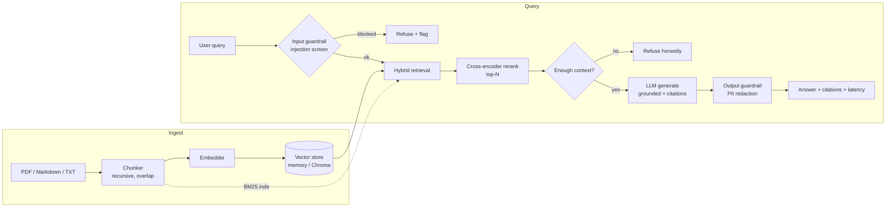

# InsightRAG — Architecture & Design Notes

## Pipeline overview

## Why these choices

| Decision | Rationale | Trade-off |
|---|---|---|
| **Hybrid retrieval (BM25 + dense)** | BM25 nails rare/exact keywords; dense embeddings catch paraphrase and synonymy. Fusing both with a tunable `alpha` beats either alone (see eval ablation MRR). | Two indexes to maintain; BM25 must be rebuilt on ingest. |
| **Cross-encoder reranker** | A bi-encoder retrieves fast but coarsely. Re-scoring the top-K with a cross-encoder that sees the (query, passage) pair together sharply improves ordering and lets us send fewer, better passages to the LLM — ~58% fewer context tokens here. | Adds latency per query; runs on CPU fine for top-20. |
| **Refuse on weak context** | A grounded assistant must say "I don't know" rather than hallucinate. We refuse before calling the LLM when retrieval/rerank scores fall below a threshold. | Threshold needs tuning per reranker backend. |
| **Citations from used markers only** | Every claim is traceable to a source passage; we only emit citations the model actually referenced, so sources reflect the answer. | Relies on the model emitting `[n]` markers (enforced in the system prompt). |
| **Pluggable deterministic backends** | Every heavy component (embeddings, reranker, LLM, store) has a lightweight offline backend. The whole pipeline + eval runs in CI with no downloads, no GPU, no API keys. | Offline backends are lexical, so they under-represent the gains real models give. |
| **Eval gate in CI** | Faithfulness, recall@5, injection-F1 and PII accuracy are asserted on every push, so a refactor can't silently degrade answer quality. | Thresholds calibrated against offline backends with margin. |

## Backend matrix

| Component | Offline default (CI) | Local / production |
|---|---|---|
| Embeddings | `hash` (hashing bag-of-words) | `sentence-transformers` (BGE) |
| Reranker | `lexical` (token overlap) | `cross-encoder` (MiniLM) |
| LLM | `stub` (extractive) | `ollama` (Llama 3.1) or `openai` |
| Vector store | `memory` (numpy) | `chroma` (persistent) |

Switch any of them with a single environment variable — see `.env.example`.

## Module map

- `rag/chunking.py` — load + recursive chunking
- `rag/providers/` — embeddings, rerank, llm backends behind small protocols
- `rag/store.py` — vector store (memory / Chroma)
- `rag/retrieve.py` — BM25 + dense fusion
- `rag/rerank.py` — cross-encoder rerank + top-N
- `rag/generate.py` — grounded generation, citations, refusal
- `guardrails/` — injection screen + PII redaction
- `rag/pipeline.py` — orchestration
- `app/main.py` — FastAPI service
- `ui/streamlit_app.py` — demo UI
- `eval_harness/` — metrics, ablation harness, CI gate
